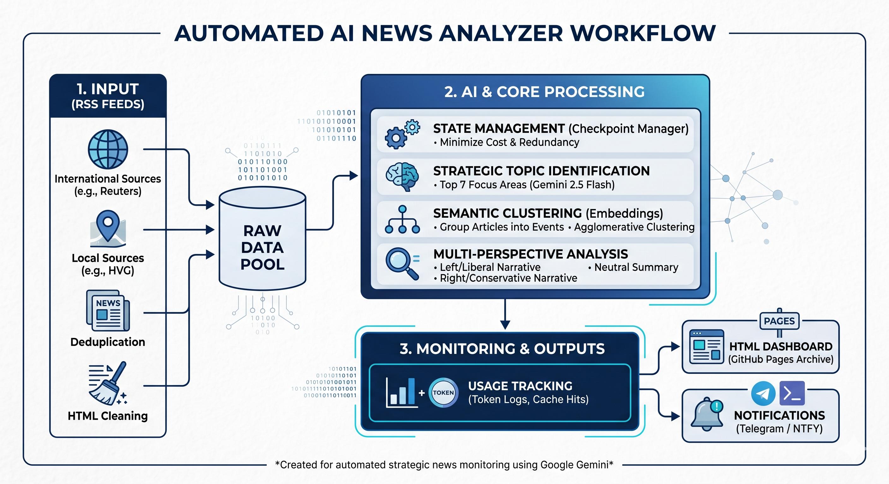

[Live Dashboard](https://green-paw.github.io/napi-hir-elemzo/)

# AI News Analyzer & Narrative Tracker

An automated news intelligence system running on GitHub Actions that aggregates, clusters, and analyzes global and local news using Google Gemini models (2.5-Flash & Flash-Lite).

## 🚀 Overview

This program automatically monitors dozens of RSS feeds, identifies the most significant daily events, and provides a neutral summary alongside a comparative analysis of different political narratives.

## 🛠️ How it Works

The workflow consists of the following key stages:

1.  **News Aggregation:** Fetches real-time articles from international (Reuters, Bloomberg, etc.) and Hungarian (HVG, 444, Mandiner, etc.) RSS feeds, performing automatic deduplication.
2.  **Strategic Filtering:** Uses AI to identify the top 7 most critical strategic focus areas (e.g., Geopolitics, Economy) to filter out noise.
3.  **Semantic Clustering:** Groups related articles into specific "events" using vector embeddings and agglomerative clustering.
4.  **Multi-Perspective Analysis:** For each event, the Gemini model generates:
    * A factual, neutral summary.
    * A breakdown of the **Left/Liberal** narrative.
    * A breakdown of the **Right/Conservative** narrative.
5.  **Automated Publishing:** Generates a professional HTML dashboard and deploys it via GitHub Pages, while sending notifications to Telegram/NTFY.

## ✨ Key Advantages

* **Cost Efficiency:** Implements a multi-tier checkpoint and caching system (Google Gemini Context Caching) to minimize API token usage.
* **Narrative Detection:** Explicitly highlights how the same event is framed differently across the political spectrum.
* **Deep Dive Integration:** Provides automated links to AI search engines (Perplexity) for further contextual research on each topic.
* **Observability:** Built-in token logger and usage tracker for precise monitoring of API costs and performance.

## ⚙️ Setup & Requirements

- **Runtime:** GitHub Actions (configured in `.github/workflows/napi_futtatas.yml`)
- **Language:** Python 3.10+
- **AI Models:** - `gemini-2.5-flash` for complex analysis.
    - `gemini-2.5-flash-lite` for cost-effective summarization.
    - `text-embedding-004` (via Gemini API) for clustering.

### Environment Variables / Secrets
- `GOOGLE_API_KEY`: Your Gemini/Vertex AI API key.
- `TELEGRAM_TOKEN` & `TELEGRAM_CHAT_ID`: (Optional) For notifications.
- `GCP_PROJECT_ID`: For Vertex AI integration.

---
*Created for automated strategic news monitoring.*
